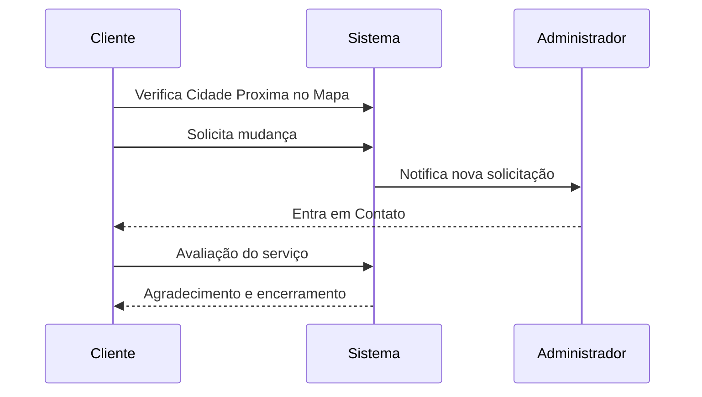

# TransKarga: Sua Mudança, Nossa Missão!
TransKarga, A TransKarga é uma empresa de transporte confiável e experiente, dedicada a facilitar mudanças de imóveis residenciais e comerciais. Nossa equipe altamente qualificada e nossos veículos modernos garantem que suas pertences sejam transportados com segurança e eficiência.🚛
## O que oferecemos:
**Mudanças Residenciais:** Se você está se mudando para uma nova casa ou apartamento, conte conosco para tornar o processo tranquilo e sem estresse. Embalamos, transportamos e entregamos seus pertences com cuidado.

**Mudanças Comerciais:** Para empresas que estão mudando de local, oferecemos soluções personalizadas para garantir que seus equipamentos, móveis e documentos sejam movidos com eficiência. Minimizamos o tempo de inatividade para que você possa voltar aos negócios rapidamente.

**Armazenamento Temporário:** Precisa de um local seguro para armazenar seus pertences durante a transição? Oferecemos serviços de armazenamento temporário em nossas instalações seguras.

**Embalagem Profissional:** Nossa equipe cuidadosa embala seus itens com materiais de alta qualidade para protegê-los durante o transporte.

**Rastreamento em Tempo Real:** Mantenha-se informado sobre o status de sua mudança com nosso sistema de rastreamento em tempo real.
## Por que escolher a TransKarga?
**Experiência:** Com anos de experiência no setor, somos especialistas em mudanças.

**Compromisso com a Qualidade:** Priorizamos a segurança e a satisfação do cliente.

**Equipe Profissional:** Nossos motoristas e equipe de carregamento são treinados e dedicados.

Visite nosso site para obter mais informações e entre em contato conosco para agendar sua mudança! 📦🏠🏢

Este repositório contém o código-fonte da nossa Landing Page, onde você encontrará detalhes sobre nossos serviços, depoimentos de clientes e informações de contato. 🌐💼

## Sobre

## Requesitos

| Requesitos Funcionais           | Requesios Não Funcionais        |
|---------------------------------|---------------------------------|
| Deve conter uma logo solida para representar a marca da transportadora de mudanças; | O serviço devera esta disposto a todos no padrao 24/7;|
| A página deve proporcionar uma descrição com o nome "sobre" que apresentar as principais informações sobre a empresa; | Não podera possibilitar falhas no envio dos formularios;| 
| A página deve proporcionar uma descrição com o nome "sobre" que apresentar as principais informações sobre a empresa;| Para funcionamento correto do mapa o serviço de geolocalização devera estar ativado durante a pesquisa de disancia;| 
| Deve conter informações como: tamanho de frota, cidades presentes, quantidade de clientes, quantidade de viagens q já foram feitas; | Os navegadores deveram estar atualizados; | 
| A página deve conter um mapa diretamente do google maps com a localização exata da empresa, podendo tambem conte um filtro por cidade; || 
| Devera conter imagens dos trabalhadores e das frotas; | | 
| Devera conter imagens dos lugares onde já foram visitados em todo o brasil; | | 

 

## Diagramas de Sequencia

## Tecnologias Usadas

 
  
  
  
  

